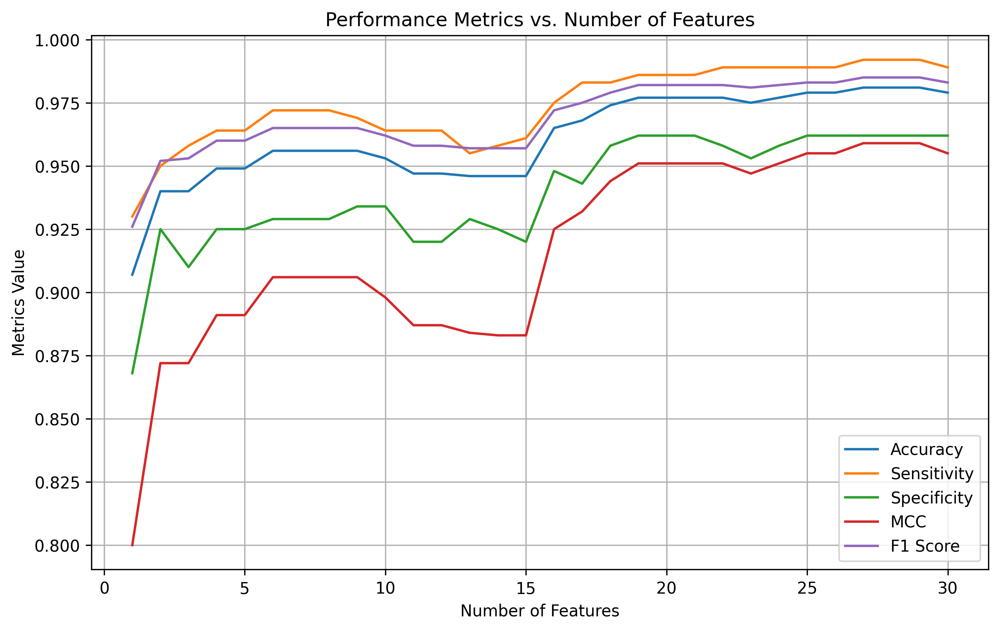
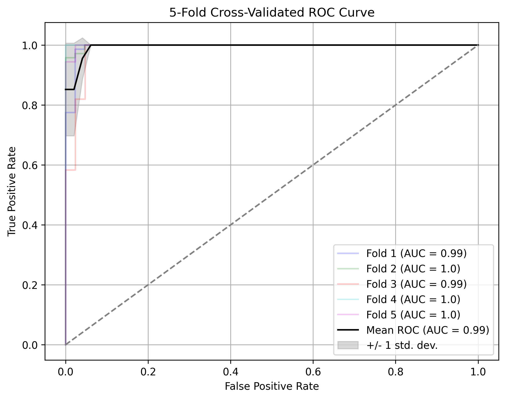
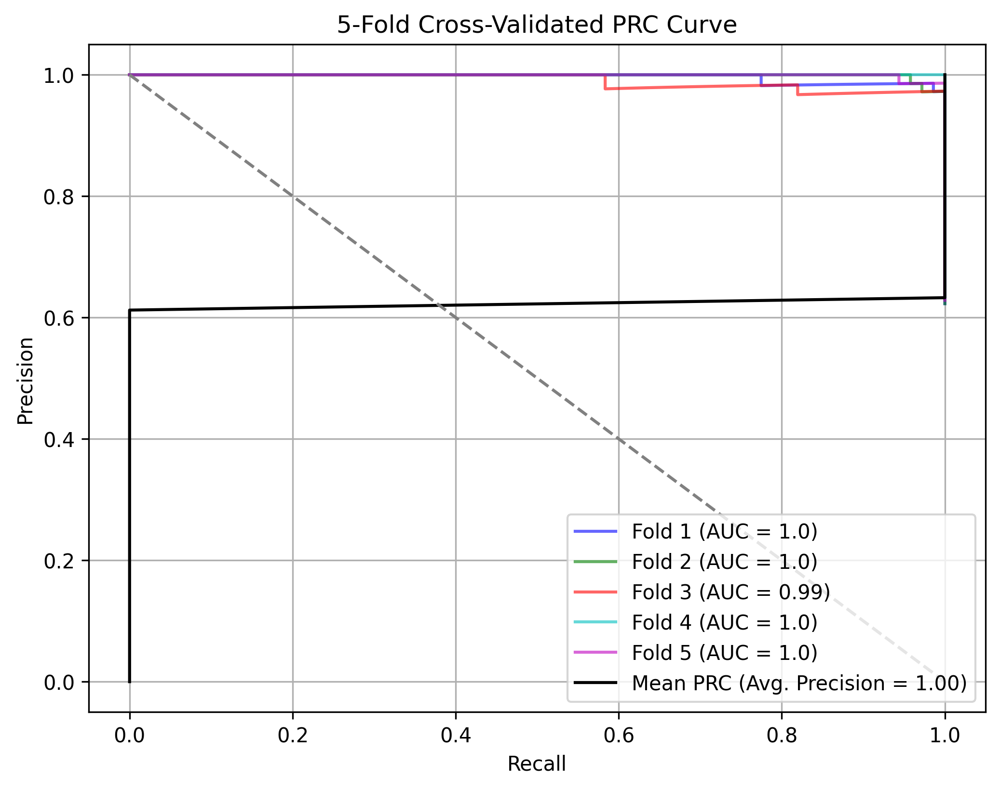

# MedML Toolkit

Predictive modeling and feature analysis for precision medicine workflows with built-in visualization and cross-validation utilities.

## Project Structure

- `src/medml_toolkit/`: core package
- `src/medml_toolkit/core.py`: MedMLToolkit class implementation
- `app.py`: Streamlit web UI
- `examples/`: runnable demo scripts
- `assets/`: curated screenshots for the README
- `outputs/`: generated plots and artifacts
- `requirements.txt`: Python dependencies
- `setup.py`: package metadata
- `pyproject.toml`: build configuration

## Dataset

Bring your own tabular dataset (features in a pandas DataFrame, labels in a pandas Series). The `examples/breast_cancer_demo.py` script uses the built-in Breast Cancer Wisconsin dataset from scikit-learn.

## Key Takeaways

- Streamlines feature selection, model training, and evaluation into a single API.
- Provides reusable plotting helpers for common ML diagnostics.
- Uses a clean, reusable project layout suitable for research and portfolio work.

## Models

### Logistic Regression
- Scikit-learn `LogisticRegression` with configurable regularization
- Grid search support via `GridSearchCV`

### Support Vector Machine (RBF)
- Scikit-learn `SVC` with probability estimates enabled
- Grid search for `C` and `gamma`

## Minimal API Example

```python
import pandas as pd
from sklearn.datasets import load_breast_cancer
from medml_toolkit import MedMLToolkit

data = load_breast_cancer()
X = pd.DataFrame(data.data, columns=data.feature_names)
y = pd.Series(data.target, name="target")

toolkit = MedMLToolkit(X, y)
toolkit.fit(fs_method="ANOVA", ifs_method="LR", ifs_grid=False, ifs_cv=5)
best_features = toolkit.transform(X, evaluate="F1")
model = toolkit.train(best_features, y, method="LR", grid=False, cv=5)
results = toolkit.cv_test(best_features, y, model, cv=5)
print(results)
```

## Skills Demonstrated

- Feature selection with ANOVA F-test and Chi-squared
- Stratified k-fold cross-validation
- Model evaluation metrics (ACC, SN, SP, MCC, F1)
- Diagnostic visualizations (ROC, PRC, correlation, clustering)

## Quick Start

```bash
git clone https://github.com/<your-username>/medml-toolkit.git
cd medml-toolkit
python -m venv medml_env
```

## Setup

A virtual environment is recommended to keep dependencies isolated.

### Windows (PowerShell)

```powershell
.\medml_env\Scripts\Activate.ps1
python -m pip install -r requirements.txt
python -m pip install -e .
```

### macOS

```bash
source medml_env/bin/activate
python3 -m pip install -r requirements.txt
python3 -m pip install -e .
```

### Linux

```bash
source medml_env/bin/activate
python3 -m pip install -r requirements.txt
python3 -m pip install -e .
```

## Run Demos

Toy dataset:

```bash
python examples/toy_demo.py
```

Real dataset (Breast Cancer Wisconsin):

```bash
python examples/breast_cancer_demo.py
```

Outputs:
- Plots saved in `outputs/breast_cancer/`
- Metrics printed to console

## Web UI

Launch the Streamlit app:

```bash
python -m streamlit run app.py
```

The app supports CSV upload and includes a built-in sample dataset. It runs feature selection, trains a model, and displays metrics and plots.

## CSV Rules

- The target column must represent discrete classes for classification (e.g., 0/1 or category labels).
- All feature columns must be numeric.
- If your target is continuous, enable "Auto-bin continuous targets" in the UI to convert it into quantile bins.
- Prefer label columns with a small number of unique values (typically 2-10).
- Example: In the sample dataset, `mean radius` is a feature and should not be used as the target.

## Latest Run (Example)

- Accuracy: 0.981
- Sensitivity: 0.992
- Specificity: 0.962
- F1-Score: 0.985
- MCC: 0.959

## Output Screenshots

### Feature Correlations


### Feature Selection Curve



### PCA Cluster


### ROC Curve



### Precision-Recall Curve



## Author

Farhan Labib
